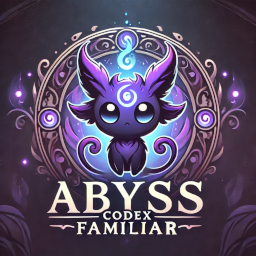

# AbySS Codex Familiar

AbySS Codex Familiar is a Visual Studio Code extension that provides custom support for the programming language [AbySS](https://github.com/liebe-magi/abyss-lang), including syntax highlighting, code snippets, and basic code completion.

## Features

- **Syntax Highlighting**: Full support for AbySS keywords, types, constants, operators, and more.
- **Code Snippets**: Handy snippets for common constructs like `forge`, `unveil`, `oracle`, `orbit`, and more.
- **Code Completion**: Auto-complete support for AbySS keywords to streamline coding.
- **Custom Folding Markers**: Utilize `// #region` and `// #endregion` to create collapsible code regions.

## How to Use

1. Install the extension in Visual Studio Code.
2. Open any `.aby` file to start using the features of AbySS Codex Familiar, including syntax highlighting, snippets, and code completion.
3. Enjoy a streamlined and enhanced coding experience with AbySS!

## Requirements

- Visual Studio Code version 1.92.0 or higher.

## Known Issues

None at the moment. Please report any issues via GitHub.

## Release Notes

### 0.0.2

- Added new keywords: `engrave`, `summon`.
- Expanded syntax highlighting to include the `abyss` type and boolean constants `boon`, `hex`.
- Introduced new snippets for function definitions (`engrave`) and standard input (`summon`).
- Updated auto-completion to support the new keywords `engrave` and `summon`.

### 0.0.1

- Initial release of `AbySS Codex Familiar` with syntax highlighting and folding markers.
- Added code snippets for common AbySS constructs.
- Introduced basic keyword completion for faster coding.
